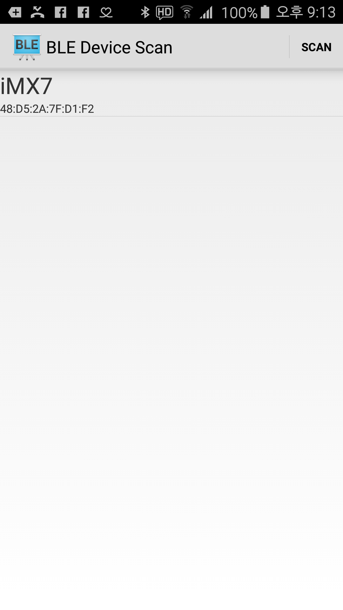
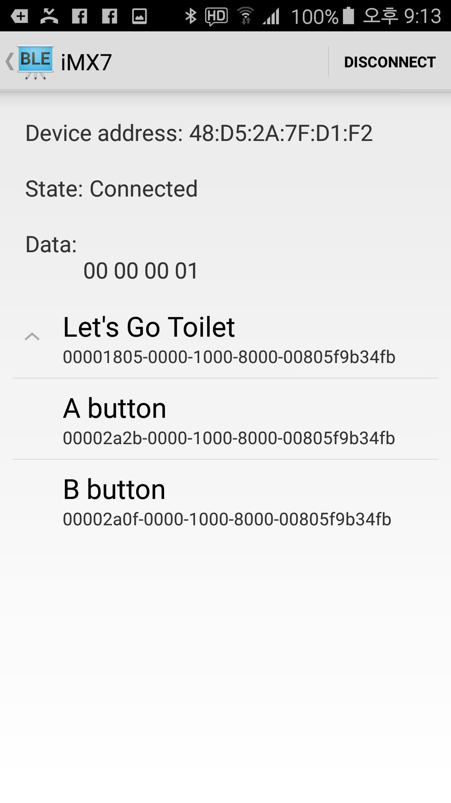

# Let's Go Toilet Client

> team logo

## introduction
- [Let's Go Toilet](https://github.com/Alice-KR/LetsGoToilet) 과 bluetooth 로 연동가능한 안드로이드 모바일 앱입니다!
- Kit의 A, B 버튼을 직접 누르지 않고, 안드로이드 모바일 앱 내의 버튼을 누르셔도 화장실에 갈 수 있어요.
- Let's go Toilet Client는 [Android BluetoothLeGatt Sample](https://github.com/googlesamples/android-BluetoothLeGatt)를 일부수정하여 만들어졌습니다.

## How to use
1. 해당 어플리케이션 zip 파일을 다운로드하거나 clone을 해주세요.
2. 안드로이드 스투디오에서 어플리케이션을 열고 메뉴의 [Run]-[Run 'apps']를 눌러 어플리케이션을 실행합니다.
3. 주변 bluetooth 장치를 scan 하고, Let's Go Toilet이 실행중인 장치를 선택해 주세요.
 
3. Let's Go Toilet 의 A button(일반버튼) 과 B button(긴급버튼)을 누르시면 됩니다.
 
- 장치 scan 이 안되신다면! 핸드폰의 Settings>Apps>BluetoothLeGatt>Permissions and enable Location 해주세요!
